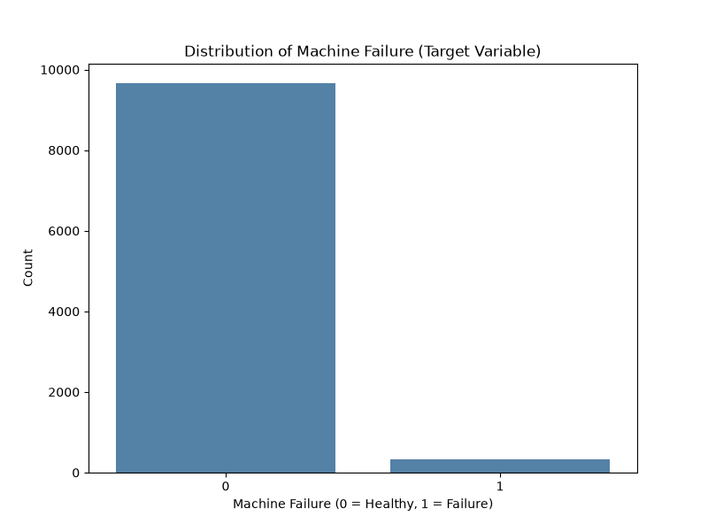
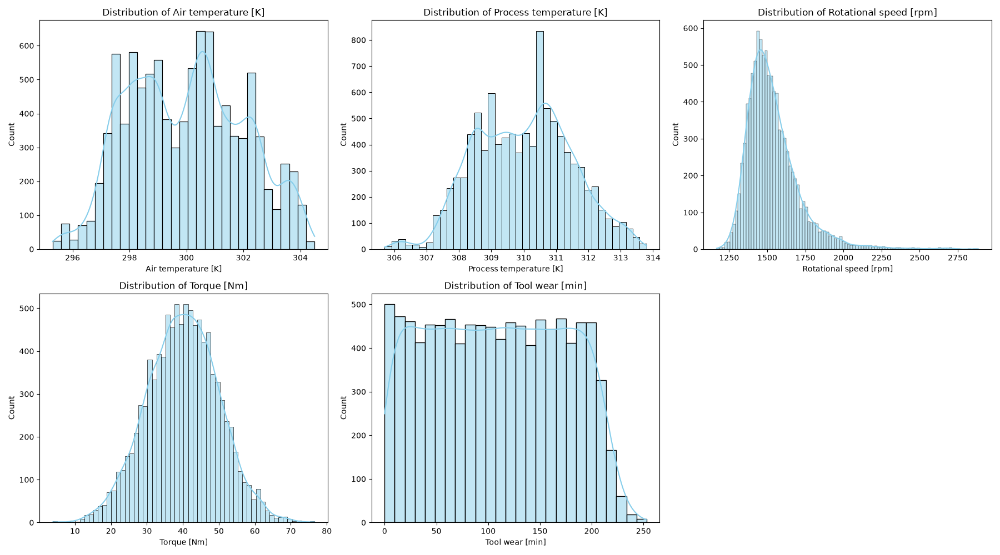
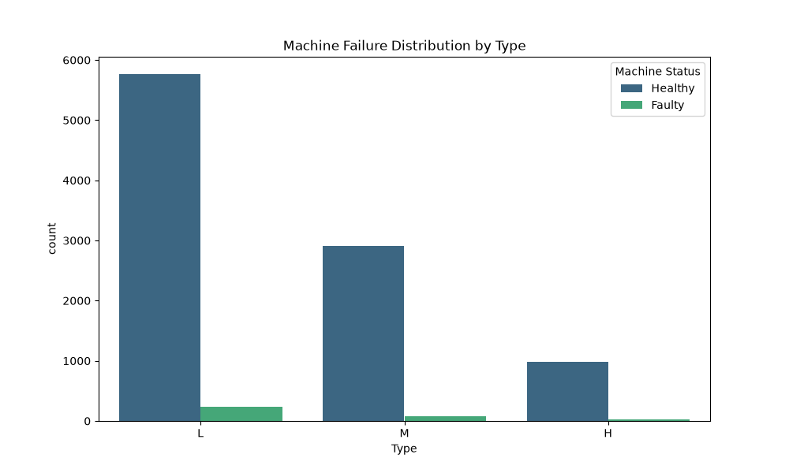
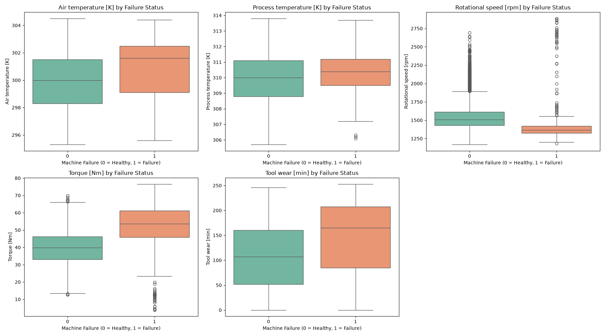
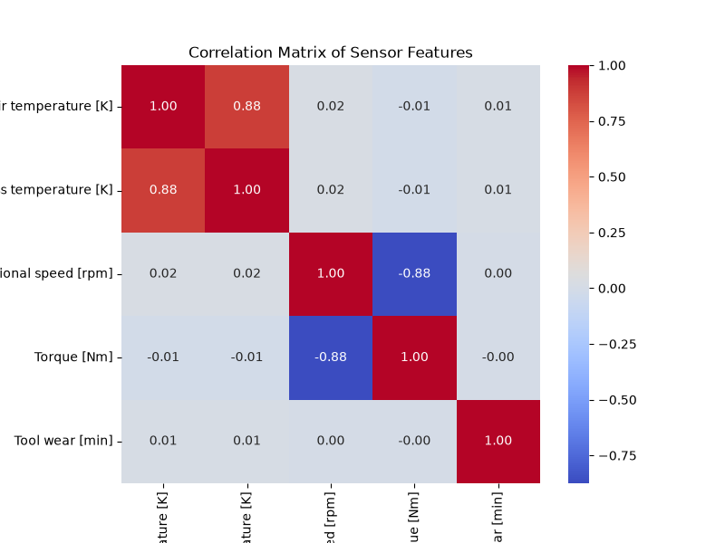
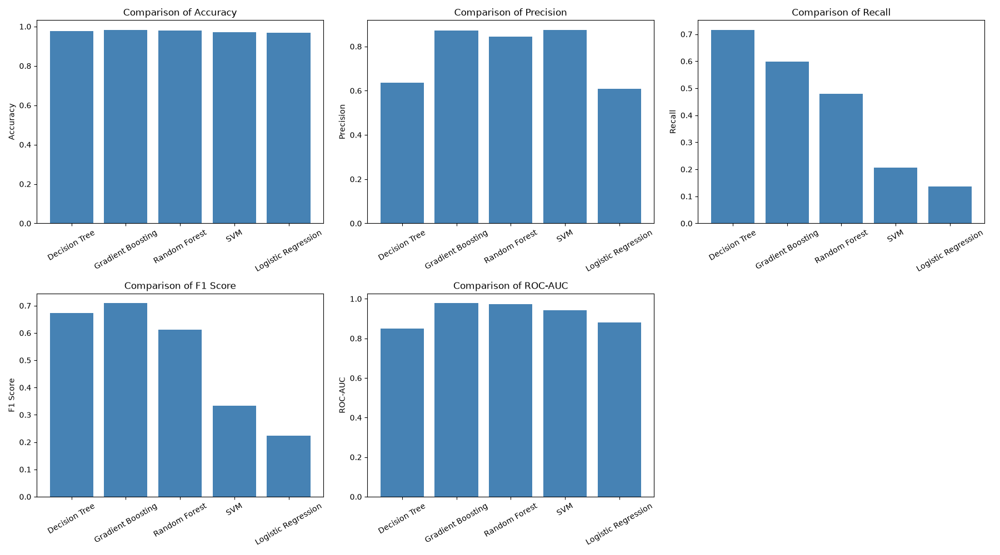
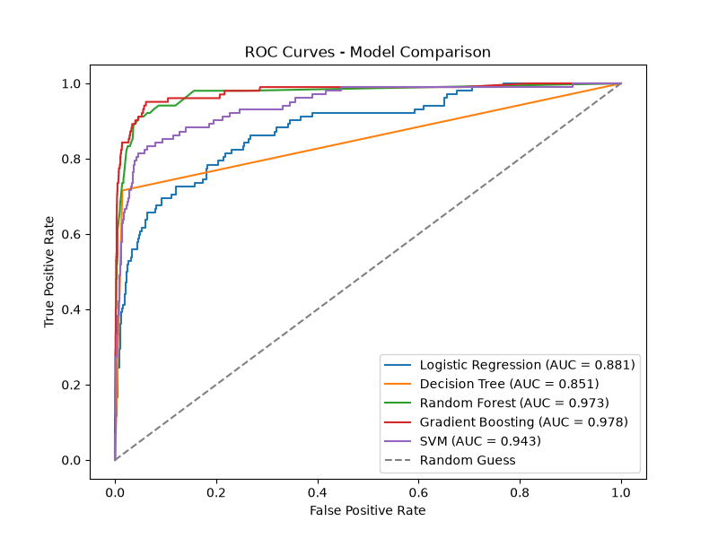

# Predictive Maintenance using Machine Learning

An end-to-end Machine Learning project that predicts machine failures using industrial sensor data. This project follows a complete industry-standard workflow, including exploratory data analysis, preprocessing, model comparison, cross-validation, hyperparameter tuning, feature importance analysis, and model persistence.

---

## Project Overview

Unexpected machine failures can result in production downtime, increased maintenance costs, equipment damage, and financial losses. Predictive maintenance aims to anticipate failures before they occur, allowing maintenance teams to schedule repairs proactively.

The objective of this project is to develop a machine learning model capable of predicting machine failures based on sensor measurements and operating conditions.

This project was built as a portfolio project to demonstrate practical machine learning skills using the complete scikit-learn workflow.

---

## Business Problem

Unexpected machine failures lead to costly downtime, production delays, and increased maintenance costs. This project develops a machine learning model that predicts failures from sensor data, enabling maintenance teams to intervene before a breakdown occurs.

Since missing an actual machine failure is significantly more costly than performing an unnecessary inspection, **Recall** was treated as one of the primary evaluation metrics throughout this project.

---

## Dataset

**AI4I 2020 Predictive Maintenance Dataset**

The dataset contains sensor measurements collected from industrial machines.

### Dataset Summary

- **10,000 machine records**
- **Binary classification problem**
- **Approximately 3.4% machine failures**
- Numerical and categorical features
- No missing values
- No duplicate records

### Features

| Feature | Description |
|----------|-------------|
| Type | Product quality type (L, M, H) |
| Air Temperature [K] | Ambient air temperature |
| Process Temperature [K] | Process temperature |
| Rotational Speed [rpm] | Rotational speed of the machine |
| Torque [Nm] | Applied torque |
| Tool Wear [min] | Tool wear duration |

**Target Variable**

- Machine Failure (Healthy / Faulty)

---

## Project Workflow

The project follows a complete end-to-end Machine Learning pipeline:

1. Business Understanding
2. Dataset Exploration
3. Exploratory Data Analysis (EDA)
4. Data Cleaning
5. Feature Selection
6. Data Preprocessing
7. Pipeline Construction
8. Model Training
9. Model Evaluation
10. Cross Validation
11. Hyperparameter Tuning
12. Feature Importance Analysis
13. Model Persistence

---

## Exploratory Data Analysis

The following analyses were performed:

- Dataset overview
- Missing value analysis
- Duplicate value analysis
- Class imbalance analysis
- Distribution of numerical features
- Distribution of machine types
- Boxplots by failure status
- Correlation heatmap
- Feature relationship analysis

### Target Distribution

The dataset is highly imbalanced — only about 3.4% of machines in the dataset have failed.



### Sensor Distributions



### Failure Rate by Machine Type



### Sensor Behavior by Failure Status



### Correlation Heatmap



### Key Findings

- The dataset is highly imbalanced (approximately 96.6% healthy machines).
- Tool Wear and Torque show strong relationships with machine failure.
- Air Temperature and Process Temperature are highly correlated.
- Tree-based models are expected to perform better due to nonlinear feature interactions.

---

## Data Preprocessing

The following preprocessing steps were applied:

- Removed identifier columns (UDI and Product ID)
- Prevented data leakage by excluding failure type columns
- One-Hot Encoding for categorical features
- Standard Scaling for numerical features (Logistic Regression and SVM)
- Separate preprocessing pipelines for tree-based models
- Stratified Train/Test Split (70/30)

---

## Models Evaluated

The following classification algorithms were compared:

- Logistic Regression
- Decision Tree
- Random Forest
- Gradient Boosting
- Support Vector Machine (SVM)

Evaluation metrics:

- Accuracy
- Precision
- Recall
- F1 Score
- ROC-AUC

---

## Model Performance

| Model | Accuracy | Precision | Recall | F1 Score | ROC-AUC |
|--------|---------:|----------:|-------:|---------:|--------:|
| Logistic Regression | 0.968 | 0.609 | 0.137 | 0.224 | 0.881 |
| Decision Tree | 0.976 | 0.635 | **0.716** | 0.673 | 0.851 |
| Random Forest | 0.979 | 0.845 | 0.480 | 0.612 | 0.973 |
| SVM | 0.972 | **0.875** | 0.206 | 0.333 | 0.943 |
| Gradient Boosting | 0.983 | 0.871 | 0.598 | 0.709 | **0.978** |
| **Gradient Boosting (Tuned)** | **0.984** | 0.829 | 0.667 | **0.739** | 0.966 |





### Confusion Matrix — Final Model


*Individual confusion matrices for all five baseline models are available in the `images/` folder and in the notebook itself.*

---

## Cross Validation Results

Five-fold Stratified Cross Validation was used to evaluate model stability.

| Model | Recall | F1 Score | ROC-AUC |
|--------|-------:|---------:|--------:|
| Decision Tree | **0.652** | 0.646 | 0.820 |
| Gradient Boosting | 0.640 | **0.734** | **0.972** |
| Random Forest | 0.507 | 0.645 | 0.963 |
| SVM | 0.268 | 0.413 | 0.949 |
| Logistic Regression | 0.186 | 0.292 | 0.896 |

The cross-validation results demonstrate that **Gradient Boosting** provides the best balance between predictive performance and model stability.

---

## Hyperparameter Tuning

The Gradient Boosting model was optimized using **GridSearchCV**.

The following hyperparameters were tuned:

- Number of Estimators
- Learning Rate
- Maximum Tree Depth
- Subsample Ratio

The tuned model achieved:

- Higher Recall
- Higher F1 Score
- Slight improvement in Accuracy

Although Precision and ROC-AUC decreased slightly, the improvement in Recall aligns better with the predictive maintenance objective of minimizing missed machine failures.

---

## Precision-Recall Trade-off

Because failures are rare (~3.4% of the data), ROC-AUC alone can look overly optimistic. The precision-recall curve below gives a clearer picture of how the tuned model performs specifically on the minority (failure) class.


---

## Feature Importance

Feature importance analysis showed that the most influential variables were:

- Tool Wear
- Torque
- Rotational Speed


These features provide the strongest predictive signals for identifying machine failures.

---

## Technologies Used

- Python
- NumPy
- Pandas
- Matplotlib
- Seaborn
- Scikit-learn
- Joblib
- Jupyter Notebook

---

## Repository Structure

```text
predictive-maintenance-ml/
│
├── data/
│   └── raw/
│       └── ai4i2020.csv
│
├── notebooks/
│   └── Predictive_Maintenance.ipynb
│
├── images/
│   └── *.png
│
├── models/
│   ├── best_gradient_boosting.pkl
│   └── best_gradient_boosting_params.json
│
├── results/
│   ├── model_comparison.csv
│   └── cross_validation_results.csv
│
├── requirements.txt
├── README.md
├── .gitignore
└── LICENSE
```

---

## Installation

Clone the repository:

```bash
git clone https://github.com/yourusername/predictive-maintenance-ml.git

cd predictive-maintenance-ml
```

Install dependencies:

```bash
pip install -r requirements.txt
```

Launch Jupyter Notebook:

```bash
jupyter notebook
```

---

## Future Improvements

Possible future enhancements include:

- Handling class imbalance using SMOTE or class-weighted learning
- Experimenting with XGBoost, LightGBM, or CatBoost
- Optimizing the decision threshold to further improve Recall
- Deploying the model using Flask or FastAPI
- Building a real-time predictive maintenance dashboard
- Integrating streaming IoT sensor data for live predictions

---

## Key Takeaways

- Built a complete end-to-end machine learning pipeline following industry best practices.
- Compared five different machine learning algorithms.
- Applied preprocessing using Scikit-learn Pipelines and ColumnTransformer.
- Used Stratified Cross Validation for robust model evaluation.
- Performed hyperparameter tuning using GridSearchCV.
- Selected the final model based on business requirements rather than accuracy alone.
- Saved the trained model for future deployment using Joblib.

---

## What I Learned

- **Accuracy is a misleading metric on imbalanced data.** With ~96.6% of machines healthy, a model that never predicts a failure would still score 96.6% accuracy while being completely useless. This project pushed me to design around Recall and F1 instead, since those actually reflect whether the model catches real failures.
- **Data leakage isn't always obvious.** The dataset includes five failure-mode flags (TWF, HDF, PWF, OSF, RNF) that are direct components of the target variable. It would have been easy to include them as "just more sensor columns" and get suspiciously perfect results — excluding them explicitly was a deliberate design decision, not an accident.
- **A single train/test split can be misleading.** Some models looked strong on the initial split but showed much higher variance across folds during cross-validation. That's what convinced me to pick Gradient Boosting over models with a slightly better single-split score but less stability.
- **Optimizing for one metric has trade-offs.** Tuning `GridSearchCV` purely on Recall improved failure detection but cost some precision — a reminder that "better" depends on what a false negative costs versus a false alarm, not just which number goes up.
- **Preprocessing needs to match the model family.** Scaling matters for Logistic Regression and SVM but is irrelevant (and can even be counterproductive) for tree-based models, which is why this project uses two separate `ColumnTransformer` pipelines instead of one-size-fits-all preprocessing.
- **Saving a model isn't the same as verifying it works.** Reloading a `joblib` file and getting predictions back doesn't guarantee correctness on its own — asserting the reloaded model's outputs match the original in-memory model turned this from "looks fine" into an actual verified guarantee.

---

## Author

**Sami Mirza**

Final-Year Electrical Engineering Student

Interested in Artificial Intelligence, Machine Learning, Data Science, and Intelligent Engineering Systems.

**GitHub:** https://github.com/yourusername
